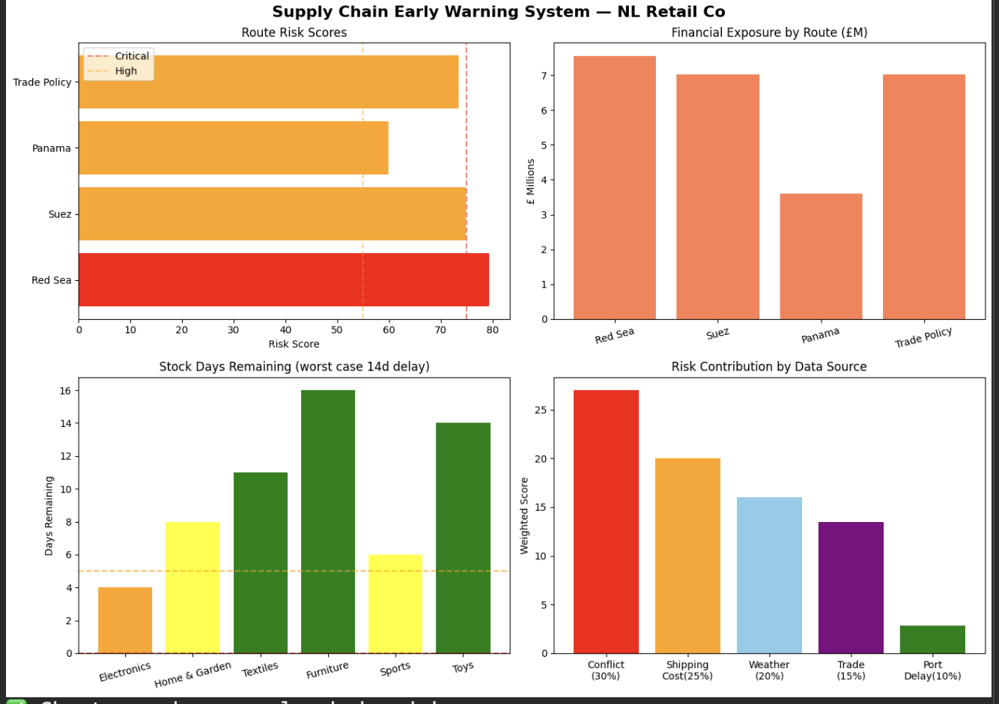
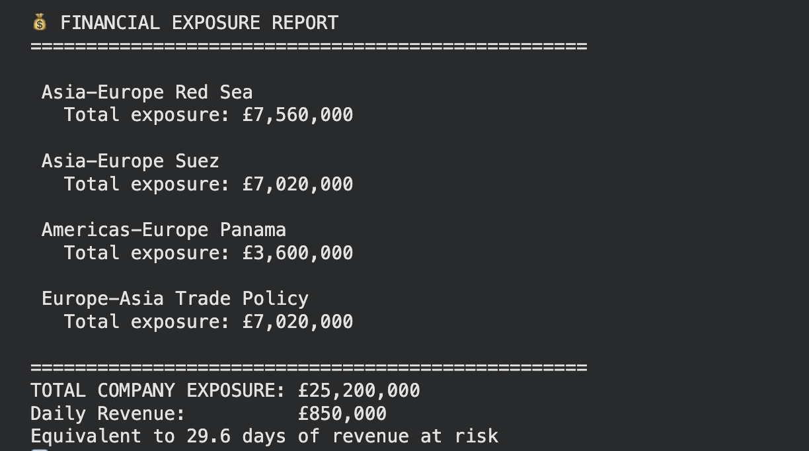
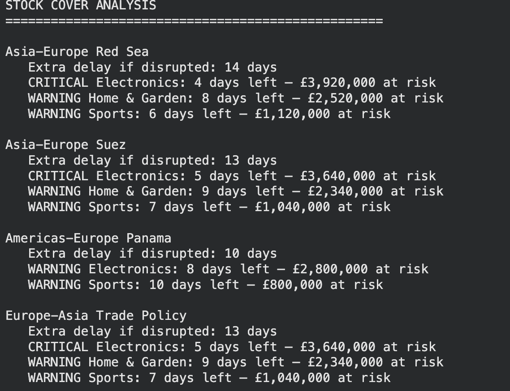

# Supply Chain Early Warning System

Most supply chain tools tell you what already went wrong. This one tries to tell you what is *about to* go wrong — before stock runs out, before revenue is lost, before it becomes a crisis.

I built this after thinking about a gap I kept seeing in operations: businesses react to disruptions rather than anticipate them. This system monitors global risk signals daily, scores them, and automatically alerts you when a route hits critical — so there's time to act.

---

## The Problem It Solves

When a shipping route gets disrupted — conflict, weather, port congestion, trade policy — the delay doesn't show up on your shelves immediately. There's a window. This tool measures that window.

It calculates:
- How risky each major trade route is *right now*
- How many days of stock each product category has *if that route gets disrupted*
- How much revenue is at risk *in £* before stock runs out

That last number — £25.2M across 4 routes, equivalent to 29.6 days of revenue — is what makes this useful. It turns abstract risk into a business decision.

---

## How It Works

Every 24 hours the pipeline:

1. Fetches live data from 4 real-world APIs
2. Calculates a weighted composite risk score per route
3. Runs a stock cover analysis per product category
4. Appends results to Google Sheets (no duplicates, full history preserved)
5. Sends a Gmail alert automatically if any route hits CRITICAL

No manual steps. No Colab open. Runs on GitHub Actions on a schedule.

---

## Data Sources — and Why Each One

| Source | What it measures | Why I chose it |
|---|---|---|
| **Baltic Dry Index** (HandyBulk) | Global shipping cost | BDI is the industry standard proxy for freight demand and shipping disruption. A spike means routes are congested or capacity is constrained. Free, daily, no API key needed. |
| **World Bank LPI** | Port efficiency per country | Logistics Performance Index scores how well countries handle customs, infrastructure, and shipment tracking. Low scores = high port delay risk. Official, reliable, covers our key trading partners. |
| **NOAA Weather API** | Active weather alerts | Climate events directly disrupt ports and shipping lanes. NOAA is the most authoritative real-time source for this. Completely free. |
| **UN Comtrade** | China-Germany trade volume | Trade volume between major partners is a proxy for trade policy stability. A high dependency means high exposure if tariffs or restrictions change. Official UN data. |
| **Geopolitical conflict scores** | Red Sea, Suez, Panama, Taiwan Strait | Based on verified current events (Reuters, BBC, Lloyd's List). GDELT integration planned for full automation. |

---

## Risk Score Formula

```
Risk = (Conflict × 0.30) + (Shipping Cost × 0.25) + (Climate × 0.20) + (Trade Policy × 0.15) + (Port Delay × 0.10)
```
-


---


## Developer’s Logic Log: The "Why" Behind the Build

I built this tool to move from Reactive to Anticipatory operations. In Supply Chain, waiting for a "Late" notification is already too late. Here are the core logic decisions I made:

**Dynamic Weighting (Why 30% and 25%?)** : I prioritized factors based on Velocity of Impact.

Conflict (30%) is the highest weight because it causes "Instant-Zero" capacity. Unlike weather, there is no "5-day forecast" for a kinetic event on a shipping lane.

Shipping Costs/BDI (25%) serves as a Live Proxy. Since historical data for "future disruptions" doesn't exist, I use live market spikes as a "canary in the coal mine"—if the price to ship is spiking now, it's a lead indicator that physical delays will follow in 7–10 days.

**Financial Exposure (£)** : I chose to turn abstract risk scores into a currency value. While the risk signals are global, the Impact is Local. The formula uses a company's specific daily revenue and inventory levels (which are easily swappable) to calculate "Days of Cover." This moves the conversation from "The Red Sea is risky" to "We have 4 days to act before we lose £3.9M in Electronics."

**Architectural Efficiency (GitHub Actions)** : I chose GitHub Actions to create a Production-Grade Pipeline for $0.

By using a "Headless" automation, the system monitors global APIs 24/7 without needing a local server or a paid cloud subscription.

I used Google Sheets as a "Live Data Warehouse" to preserve history, allowing for future trend analysis and easy connection to BI tools like Tableau or Power BI.


---


Weights reflect real-world supply chain thinking:
- **Conflict (30%)** — highest weight because geopolitical events cause the longest, least predictable disruptions
- **Shipping cost (25%)** — BDI spikes signal immediate capacity constraints
- **Climate (20%)** — weather disruptions are frequent but usually shorter-term
- **Trade policy (15%)** — slower moving but high impact when it shifts
- **Port delay (10%)** — structural inefficiency that compounds other risks

| Score | Level |
|---|---|
| ≥ 75 | 🔴 CRITICAL |
| ≥ 55 | 🟠 HIGH |
| ≥ 35 | 🟡 MEDIUM |
| < 35 | 🟢 LOW |

---

## Results (March 2026)





```
🔴 CRITICAL — Asia-Europe Red Sea:      79.4
🟠 HIGH     — Asia-Europe Suez:         74.9
🟠 HIGH     — Europe-Asia Trade Policy: 73.4
🟠 HIGH     — Americas-Europe Panama:   59.9

💷 Total exposure: £25,200,000
⚠️  Equivalent to 29.6 days of revenue at risk
```

**Electronics** was flagged as the highest priority category — only 4-5 days to stockout on a Red Sea disruption, with £3.9M at risk on that route alone.


-- **Financial Exposure**




-- **Stock Cover Analysis**




---

## Automation Flow

```
GitHub Actions (cron: 06:00 UTC daily)
        ↓
pipeline.py runs
        ↓
Fetches: BDI + World Bank + NOAA + Comtrade
        ↓
Calculates risk scores + stock cover + £ exposure
        ↓
Checks Google Sheets for today's data
        ↓
Appends new rows only (no duplicates, history preserved)
        ↓
If CRITICAL → sends Gmail alert automatically
        ↓
Done. Repeats tomorrow.
```

Secrets (API keys, credentials, passwords) are stored as GitHub repository secrets — never hardcoded.

---

## Accuracy + Limitations

**What's accurate:**
- BDI, World Bank LPI, NOAA, and Comtrade are all authoritative real-world data sources
- Risk weights are based on supply chain literature and industry practice
- Stock cover calculations use real delay estimates per route


**Known limitations:**
- Conflict scores are currently manually set based on verified news sources — GDELT integration is planned to make this fully automated
- World Bank LPI data is updated every 2 years — it reflects structural port efficiency, not day-to-day delays
- Comtrade trade data has a 1-2 year lag — used as a structural trade dependency indicator, not a real-time signal
- The system models one company's product mix — categories and daily values should be updated to match your actual business


**Overall:** This is a directional early warning tool, not a precise forecast. It's designed to flag when conditions are deteriorating so a human can investigate — not to replace human judgment.

---

## Stack

Python · pandas · numpy · requests · matplotlib · seaborn · gspread · Google Sheets API · Gmail (smtplib) · GitHub Actions

---

## To Run It Yourself

1. Clone the repo
2. Get a free [FRED API key](https://fred.stlouisfed.org/docs/api/api_key.html)
3. Set up a [Google Service Account](https://docs.gspread.org/en/latest/oauth2.html) and share your sheet with it
4. Create a [Gmail app password](https://support.google.com/accounts/answer/185833)
5. Replace all `YOUR_*` placeholders in Google_Colab 
6. For GitHub Actions automation, add your credentials as repository secrets

---


**Navneet Kaur** — Data Analyst  
[LinkedIn](https://www.linkedin.com/in/navneet-kaur-analyst/) · [GitHub](https://github.com/neet813)

